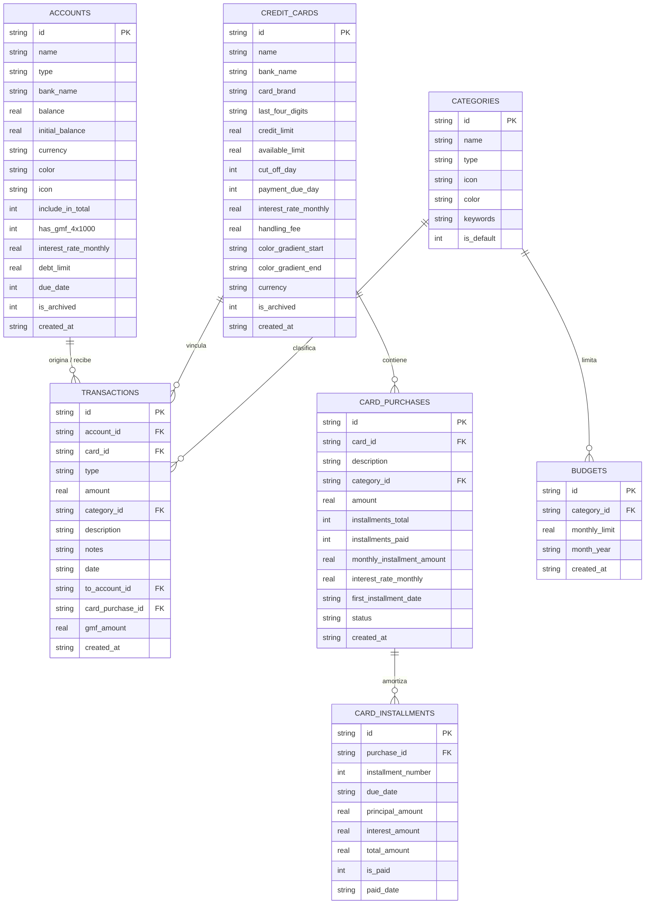

# INFORME DE AUDITORÍA TÉCNICA Y FUNCIONAL COMPLETA
**Aplicación:** Mi Billetera & Gastos (`gestion-gastos`)  
**Versión:** 1.0.0 (Expo SDK 54 / React Native 0.81.5)  
**Fecha de Auditoría:** 31 de Agosto de 2026  
**Tipo de Documento:** Auditoría exhaustiva de arquitectura, modelo financiero, base de datos y lógica de negocio.

---

## 1. Executive Summary

La aplicación **Mi Billetera & Gastos** es un gestor integral de finanzas personales diseñado específicamente para el contexto financiero colombiano y latinoamericano, ejecutándose localmente (*Local-First*) sobre dispositivos móviles Android e iOS. 

Actualmente permite:
1. Administrar cuentas líquidas de ahorro, corriente, efectivo y billeteras digitales (Nequi, Daviplata).
2. Manejar cuentas de pasivo/deuda personal (cafetería, fiados, préstamos de palabra) con opciones de pago directo o diferido.
3. Administrar tarjetas de crédito con amortización de cuotas mediante sistema francés, simulación de extractos, promociones 0% interés y cálculo de ciclos de corte y pago en tiempo real.
4. Aplicar y categorizar de forma automática el impuesto bancario colombiano **4x1000 (GMF - 0.4%)**.
5. Clasificar automáticamente transacciones mediante un motor semántico de IA basado en palabras clave y texto predictivo.
6. Parsear mensajes SMS y notificaciones bancarias locales de entidades como Bancolombia, Nu, Nequi, Davivienda, BBVA, Falabella y Scotiabank.
7. Alertar de forma programada a través del sistema operativo sobre cortes y vencimientos de tarjetas de crédito.

**Estado General:** La aplicación cuenta con una base arquitectónica sólida, un diseño visual oscuro muy pulido y una excelente base de datos relacional SQLite embebida. Sin embargo, existen vacíos conceptuales en la diferenciación entre *Consumo* (Causación) vs *Flujo de Caja* (Caja), ausencia de soporte real para CDTs/Inversiones (más allá de la etiqueta), falta de historial de auditoría/conciliación bancaria y riesgos de integridad al eliminar o editar ciertos movimientos históricos.

---

## 2. Technology Stack

- **Framework Móvil:** Expo SDK `~54.0.37` con React Native `0.81.5` y React `19.1.0`.
- **Lenguaje:** TypeScript `~5.9.2` con tipado estricto en configuración `tsconfig.json`.
- **Base de Datos Local:** `expo-sqlite ~16.0.10` ejecutándose con `PRAGMA journal_mode = WAL` y `PRAGMA foreign_keys = ON`.
- **Almacenamiento Clave-Valor:** `@react-native-async-storage/async-storage 2.2.0` para preferencias de usuario (moneda, saldos ocultos, flags de inicialización).
- **Iconografía:** `lucide-react-native ^1.35.0` con adaptador dinámico `CustomIcon.tsx`.
- **Gradientes & UI:** `expo-linear-gradient ~15.0.8`, `react-native-safe-area-context ~5.6.0`, `react-native-svg 15.12.1`.
- **Notificaciones del Sistema:** `expo-notifications ~0.32.17` con canales prioritarios de Android.
- **Criptografía:** `expo-crypto ~15.0.9`.
- **Actualizaciones Over-The-Air (OTA):** `expo-updates ~29.0.20` conectado al servicio de EAS Update (`preview` channel).

---

## 3. Project Architecture

El proyecto sigue una arquitectura por capas desacopladas dentro del directorio `src/`:

```text
src/
├── types/          # Definición de interfaces TypeScript y tipos de dominio
├── database/       # Conexión SQLite, esquema DDL, migraciones y seeders
│   └── repositories/ # Capa de Acceso a Datos (DAO / Repositories)
├── context/        # Estado global (FinancialContext, AlertContext)
├── utils/          # Motores matemáticos, clasificadores IA, formateadores y parsers
├── components/     # Componentes visuales organizados por dominio
│   ├── accounts/
│   ├── cards/
│   ├── categories/
│   ├── common/
│   └── transactions/
└── screens/        # Vistas principales de navegación
```

- **Patrón de Estado:** React Context API (`FinancialContext`) centraliza la carga y mutación de datos. Cada mutación persiste inmediatamente en SQLite mediante los repositorios y luego ejecuta `loadData()` para sincronizar el estado reactivo en memoria.
- **Navegación:** Navegación por pestañas (*Bottom Tab Bar*) implementada a medida en `App.tsx` con soporte para Dynamic Island / Safe Area Insets.

---

## 4. Current Feature Map

| FUNCIÓN | EXISTE | ESTADO | UBICACIÓN EN CÓDIGO | OBSERVACIONES |
| :--- | :---: | :---: | :--- | :--- |
| **Gestión de Cuentas Líquidas** | Sí | `Correcta` | `src/components/accounts/AddAccountModal.tsx`, `accountRepository.ts` | Soporta Ahorros, Corriente, Billetera, Efectivo. |
| **Cuentas de Deuda / Fiados** | Sí | `Correcta` | `src/components/accounts/AddAccountModal.tsx`, `PayDebtModal.tsx` | Gastos aumentan deuda; liquidación con cuenta o tarjeta. |
| **Tarjetas de Crédito** | Sí | `Correcta` | `src/components/cards/`, `cardRepository.ts`, `financialMath.ts` | Amortización de cuotas, cupo disponible y fechas de corte. |
| **Impuesto 4x1000 (GMF)** | Sí | `Correcta` | `src/components/transactions/AddTransactionModal.tsx`, `TransactionItem.tsx` | Cálculo automático del 0.4% en cuentas gravadas con desglose. |
| **Transferencias entre Cuentas** | Sí | `Correcta` | `src/components/transactions/AddTransactionModal.tsx` | Disminuye origen y aumenta destino en una sola operación. |
| **Clasificador IA de Categorías** | Sí | `Funcional pero mejorable` | `src/utils/aiCategorizer.ts` | Clasifica por scoring léxico; requiere keywords enriquecidas. |
| **Parser de SMS Bancarios** | Sí | `Funcional pero mejorable` | `src/utils/bankNotificationParser.ts` | Regex para Colombia; no cubre el 100% de formatos nuevos. |
| **Presupuestos Mensuales** | Sí | `Incompleta` | `src/database/repositories/budgetRepository.ts` | Existe tabla y repositorio, pero falta interfaz completa de edición y alerta de sobrepaso. |
| **CDTs / Inversiones** | Parcial | `Incompleta` | `src/types/finance.ts` (`'investment'`) | Solo existe como etiqueta de tipo de cuenta; no calcula rendimientos, plazos ni retenciones. |
| **Conciliación Bancaria** | No | `No existe` | N/A | No permite comparar extracto bancario oficial vs saldo registrado. |
| **Exportación / Backup de Datos** | No | `No existe` | N/A | No hay exportación a CSV/JSON ni copia de seguridad en la nube/local. |
| **Bloqueo Biométrico / PIN** | No | `No existe` | N/A | La app abre directamente sin protección biométrica. |

---

## 5. Current Financial Model

Actualmente la aplicación representa el dinero bajo los siguientes principios:

1. **Activos Disponibles (`totalBankBalance`):** Suma el saldo de las cuentas donde `type !== 'debt'` y `includeInTotal !== false` ([FinancialContext.tsx](file:///c:/Users/siste/Documents/+Cristian%20Mestra/+gestion_gatos/gestion-gastos/src/context/FinancialContext.tsx#L140-L144)).
2. **Deuda en Tarjetas (`totalCreditDebt`):** Calculado como el crédito total utilizado en todas las tarjetas activas ([FinancialContext.tsx](file:///c:/Users/siste/Documents/+Cristian%20Mestra/+gestion_gatos/gestion-gastos/src/context/FinancialContext.tsx#L153)).
3. **Deudas Personales (`totalOtherDebts`):** Suma del valor absoluto de los saldos negativos de cuentas con `type === 'debt'` ([FinancialContext.tsx](file:///c:/Users/siste/Documents/+Cristian%20Mestra/+gestion_gatos/gestion-gastos/src/context/FinancialContext.tsx#L149-L151)).
4. **Deuda Total Consolidada (`totalAllDebts`):** `totalCreditDebt + totalOtherDebts`.
5. **Patrimonio Neto (`netWorth`):** `totalBankBalance - totalAllDebts`.
6. **Ingresos del Mes (`monthlyIncome`):** Suma de transacciones con `type === 'income'` cuya fecha corresponda al mes actual.
7. **Gastos del Mes (`monthlyExpense`):** Suma de transacciones con `type === 'expense'` o `type === 'card_purchase'`.

---

## 6. Account System

### [ACTUAL] Tipos de Cuenta Soportados:
- `'savings'` (Ahorros)
- `'checking'` (Corriente)
- `'wallet'` (Billetera Digital)
- `'cash'` (Efectivo)
- `'investment'` (Inversión / CDT)
- `'debt'` (Deuda / Fiado / Cuenta por Pagar)

### [RIESGO] Limitaciones del Sistema de Cuentas:
- **Cuentas de Inversión / CDT:** Se comportan internamente idéntico a una cuenta de ahorros común. No almacenan tasa de rentabilidad, fecha de vencimiento, plazo en días ni capital inmovilizado.
- **Multidivisa:** La tabla `accounts` almacena `currency TEXT NOT NULL DEFAULT 'COP'`, pero el cálculo de `totalBankBalance` suma todos los saldos algebraicamente sin conversión de tasa de cambio (TRM).

---

## 7. Transactions System

### [ACTUAL] Tipos de Movimiento:
- `income`: Incrementa el saldo de `account_id`.
- `expense`: Disminuye el saldo de `account_id` por `amount + gmfAmount`.
- `transfer`: Disminuye `account_id` por `amount + gmfAmount` e incrementa `to_account_id` por `amount`.
- `card_purchase`: Registra el consumo y su amortización a cuotas en `card_purchases` y `card_installments`.
- `card_payment`: Disminuye `account_id` y libera cupo en `credit_cards`.

### [BUG] Reversión Incompleta al Eliminar Transacciones:
En `src/database/repositories/transactionRepository.ts` (función `delete(id)`), si el usuario elimina un movimiento de tipo `'card_payment'`, el saldo descontado de la cuenta bancaria **no se devuelve**, ya que solo hay ramas para `'expense'`, `'income'` y `'transfer'`.

---

## 8. Credit Cards

### [ACTUAL] Capacidades Implementadas:
- **Amortización:** Generación de cronograma de pagos mediante cuota fija con Sistema Francés ([financialMath.ts:L28-L44](file:///c:/Users/siste/Documents/+Cristian%20Mestra/+gestion_gatos/gestion-gastos/src/utils/financialMath.ts#L28-L44)).
- **Promociones 0% Interés:** Permite diferir compras a múltiples cuotas sin cobrar intereses cuando aplican convenios.
- **Compras Históricas:** Permite ingresar compras ya realizadas indicando cuántas cuotas ya fueron pagadas.
- **Ciclo de Facturación Activo:** Detecta en tiempo real si el corte del mes en curso ya ocurrió (resaltando en rojo) y calcula con precisión los días para el pago.

### [RIESGO] Manejo de Cuotas de Manejo y Pagos Extraordinarios:
- La cuota de manejo (`handlingFee`) se proyecta en el simulador de extracto, pero no se genera como una transacción contable recurrente en la base de datos hasta que se pague manualmente.
- No hay opción de realizar abonos extraordinarios dirigidos a compras específicas para reducir plazo vs reducir cuota.

---

## 9. Debts and Loans

### [ACTUAL] Cuentas de Deuda:
- Se modelan mediante cuentas con `type === 'debt'`.
- Los gastos vinculados a la cuenta incrementan el saldo adeudado (`-$XX.XXX`).
- El modal `PayDebtModal.tsx` permite abonar o cancelar la deuda utilizando una cuenta bancaria o difiriendo el pago con tarjeta de crédito a cuotas.

### [MEJORA] Préstamos Formales con Tabla de Amortización:
Actualmente las deudas personales manejan un saldo acumulado simple. Para préstamos bancarios de libre inversión o libranzas, no existe aún una tabla de amortización decreciente ni separación mensual entre abono a capital e intereses corrientes.

---

## 10. Investments and CDTs

### [ACTUAL] Estado Actual:
Actualmente existe la opción de crear una cuenta tipo `'investment'`, pero carece de la lógica financiera especializada requerida para inversiones reales.

### [PROPUESTA DE ARQUITECTURA] Integración Conceptual de CDTs e Inversiones:
1. **Entidad CDT (`cdts` table):**
   - `id`, `bank_name`, `principal_amount`, `interest_rate_ea`, `term_days`, `start_date`, `maturity_date`, `source_account_id`, `destination_account_id`, `status` ('active' | 'matured' | 'cancelled').
2. **Impacto Contable:**
   - La constitución de un CDT debe originar una transacción de tipo `'investment_deposit'` que descuenta de la cuenta de ahorros e incrementa el activo de CDT. **El patrimonio neto permanece inalterado** (cambio de composición de activos).
   - Al vencer, se acredita el capital más los rendimientos netos (restando retención en la fuente si aplica) en la cuenta destino.

---

## 11. Transfers

- **Entre Cuentas Bancarias:** Descuenta de origen e incrementa destino en `TransactionRepository.create` ([transactionRepository.ts:L108-L111](file:///c:/Users/siste/Documents/+Cristian%20Mestra/+gestion_gatos/gestion-gastos/src/database/repositories/transactionRepository.ts#L108-L111)).
- **Impuesto 4x1000:** Si la cuenta de origen tiene `hasGmf4x1000 === true`, se descuenta el 0.4% adicional de la cuenta origen sin afectar el monto neto que recibe la cuenta destino.

---

## 12. Budgets

- **Modelo:** Tabla `budgets` con `id`, `category_id`, `monthly_limit`, `month_year`.
- **Estado:** La estructura de datos existe en base de datos (`budgetRepository.ts`), pero en las pantallas actuales no hay una vista dedicada que muestre barras de progreso de consumo presupuestal por categoría o notificaciones de advertencia al alcanzar el 80% o 100% del límite.

---

## 13. Cash Flow

### [RIESGO] Diferenciación entre Consumo y Flujo de Caja:
Actualmente, si el usuario compra un electrodoméstico de `$1.200.000` a 12 cuotas con tarjeta de crédito:
- En el mes de la compra, el gasto del mes reporta `$1.200.000` (Consumo total).
- En los meses subsecuentes, los pagos de cuotas de `$115.000` son registrados como `'card_payment'`, por lo que no figuran en el gasto mensual del dashboard.
- **Solución Recomendada:** Ofrecer en reportes dos métricas claras:
  - **Gasto por Consumo (Devengado / Causación):** Cuánto consumí este mes.
  - **Salida Real de Dinero (Caja / Flujo de Efectivo):** Cuánto dinero salió efectivamente de mis cuentas bancarias este mes.

---

## 14. Net Worth

El cálculo actual `netWorth = totalBankBalance - totalAllDebts` es matemáticamente consistente con los datos registrados:
- **Activos:** Cuentas líquidas activas.
- **Pasivos:** Cupo utilizado en tarjetas + saldo negativo de deudas personales.

---

## 15. Financial Calculation Review

1. **Conversión de Tasas (E.A. a E.M.):**
   $$\text{EM} = (1 + \text{EA})^{1/12} - 1$$
   Implementada correctamente en [financialMath.ts:L7-L12](file:///c:/Users/siste/Documents/+Cristian%20Mestra/+gestion_gatos/gestion-gastos/src/utils/financialMath.ts#L7-L12).
2. **Cuota Fija (Sistema Francés):**
   $$\text{Cuota} = P \times \frac{r(1+r)^n}{(1+r)^n - 1}$$
   Implementada correctamente en [financialMath.ts:L28-L44](file:///c:/Users/siste/Documents/+Cristian%20Mestra/+gestion_gatos/gestion-gastos/src/utils/financialMath.ts#L28-L44).
3. **Impuesto 4x1000 (GMF):**
   $$\text{GMF} = \text{Monto} \times 0.004$$
   Implementada correctamente en [AddTransactionModal.tsx:L158](file:///c:/Users/siste/Documents/+Cristian%20Mestra/+gestion_gatos/gestion-gastos/src/components/transactions/AddTransactionModal.tsx#L158).

---

## 16. Data Model Review

### Diagrama Entidad-Relación Conceptual:



---

## 17. Data Integrity Risks

1. **[RIESGO] Falta de Transacciones Atómicas (Database Transactions):**
   Operaciones compuestas (ej. crear una compra a cuotas + insertar 12 cuotas + actualizar cupo) ejecutan múltiples `db.runAsync` independientes. Si la app se cierra a mitad del proceso, pueden quedar registros huérfanos. Debe envolverse en `db.withTransactionAsync`.
2. **[RIESGO] Desfase en Edición de Movimientos Históricos:**
   Actualmente no hay interfaz para editar el monto de un gasto ya guardado. Si se implementa en el futuro, debe recalcularse la diferencia del saldo de la cuenta asociada.

---

## 18. Bugs Found

### Bug 1: Reversión faltante al eliminar pagos de tarjeta (`card_payment`)
- **Severidad:** Media-Alta
- **Ubicación:** `src/database/repositories/transactionRepository.ts`, líneas 127-138.
- **Cómo reproducir:** Registrar un pago a tarjeta de crédito desde Bancolombia por $100.000. Luego, en Historial, eliminar dicho movimiento.
- **Comportamiento Actual:** La transacción se borra pero los $100.000 no se reintegran al saldo de Bancolombia.
- **Comportamiento Esperado:** Reintegrar el dinero a la cuenta origen.
- **Causa:** Falta la condición `else if (tx.type === 'card_payment' && tx.account_id)` en `TransactionRepository.delete`.
- **Solución Sugerida:** Agregar la restitución del saldo en el repositorio.

### Bug 2: Omisión del 4x1000 en el cálculo de gastos de `TransactionsScreen`
- **Severidad:** Baja-Media
- **Ubicación:** `src/screens/TransactionsScreen.tsx`, líneas 98-101.
- **Cómo reproducir:** Registrar un gasto de $67.000 con 4x1000 ($268).
- **Comportamiento Actual:** El banner mensual de gastos en el historial suma $67.000 en lugar de $67.268.
- **Comportamiento Esperado:** Sumar `tx.amount + (tx.gmfAmount || 0)` en los gastos totales del mes.
- **Causa:** `monthTotals` solo suma `tx.amount`.

---

## 19. Financial Logic Problems

1. **Compras a cuotas vs Flujo de Caja mensual:** Como se analizó en la sección 13, registrar el 100% de una compra diferida a 24 meses en el mes 1 distorsiona las estadísticas del mes corriente si el usuario busca medir su flujo de caja real.
2. **Tratamiento de Deudas en Inversión:** Los rendimientos generados por inversiones no tienen un tipo de transacción nativo `'investment_yield'`, catalogándose como un `'income'` genérico sin trazabilidad sobre qué activo lo produjo.

---

## 20. Security Review

- **Almacenamiento Local:** La base de datos SQLite no está cifrada con SQLCipher (estándar para apps locales sin backend).
- **Control de Acceso:** No hay bloqueo por huella digital/FaceID ni PIN numérico al abrir la app.
- **Seguridad en Producción:** No hay credenciales ni llaves API sensibles expuestas en el código fuente del cliente.

---

## 21. Performance Review

- **Listas Largas:** `TransactionsScreen.tsx` utiliza `ScrollView` con `.map()` en lugar de `FlatList`. Con más de 300 transacciones acumuladas en el historial, esto generará degradación en el renderizado inicial y el scroll.
- **Uso de Índices SQLite:** Las columnas frecuentemente consultadas (`transactions.date`, `transactions.account_id`, `card_installments.purchase_id`) se beneficiarán enormemente de la adición de `CREATE INDEX IF NOT EXISTS`.

---

## 22. UX Functional Review

- **Feedback de Eliminación:** Excelente (resuelto recientemente con modal glassmorphic).
- **Estados Vacíos:** Todas las pantallas cuentan con tarjetas descriptivas de estado vacío con iconos y llamadas a la acción (*Empty States*).
- **Edición de Movimientos:** Actualmente el usuario solo puede eliminar movimientos con toque prolongado; no existe un modal para editar la descripción, fecha o categoría de un gasto ya creado.

---

## 23. Test Coverage

- **Estado Actual:** 0% de cobertura formal. No hay configuración de Jest / React Native Testing Library instalada en `package.json`.
- **Riesgo:** Las funciones matemáticas críticas de amortización y ciclo de tarjetas dependen actualmente de verificación manual.

---

## 24. Missing Tests (Batería Recomendada)

1. **Test de Amortización Francesa:** Validar que la suma del capital de las $N$ cuotas sea exactamente igual al capital original prestado ($P$).
2. **Test de Ciclos de Corte y Vencimiento:** Probar los 12 meses del año con días de corte 28, 30 y 31 (incluyendo febrero bisiesto).
3. **Test de Deducción 4x1000:** Validar que una transferencia de $1.000.000 debite exactamente $1.004.000 de la cuenta origen y acredite $1.000.000 en destino.
4. **Test de Reversión de Saldo en Cascadas:** Probar que al eliminar una cuenta o tarjeta se ajusten o limpien debidamente los registros dependientes.

---

## 25. Missing Features (Clasificadas)

1. **[CRÍTICA] Módulo Especializado de CDTs / Inversiones:** Para registrar capital, plazos en días, tasa E.A., fecha de vencimiento y acreditación automática de rendimientos sin contarlo como gasto.
2. **[CRÍTICA] Edición de Transacciones:** Permitir modificar monto, fecha, categoría o notas de un movimiento existente sin tener que borrarlo y recrearlo.
3. **[IMPORTANTE] Vista de Presupuestos Activa:** Interfaz gráfica para fijar topes de gasto mensual por categoría y ver el termómetro de consumo en tiempo real.
4. **[IMPORTANTE] Exportación y Copia de Seguridad:** Exportar datos a formato CSV/Excel y generar backup local del archivo SQLite para transferir entre dispositivos.
5. **[RECOMENDADA] Bloqueo Biométrico (FaceID / Huella):** Protección de acceso a la información financiera.
6. **[RECOMENDADA] Optimización con FlatList:** Migrar las listas de transacciones para rendimiento fluido a largo plazo.
7. **[OPCIONAL] Múltiples Monedas con Tasa de Cambio Manual:** Para registrar ahorros en USD o EUR con su valor equivalente en COP.

---

## 26. Recommended Improvements

1. **Unificar modelo de gastos devengados vs flujo de caja en reportes.**
2. **Agregar índices en SQLite (`transactions_date_idx`, `transactions_account_idx`).**
3. **Completar la lógica de reversión de saldo para todos los tipos de transacción en `TransactionRepository.delete`.**

---

## 27. Technical Debt

- `TransactionsScreen.tsx` contiene 803 líneas de código acoplando lógica de filtrado, estadísticas de categorías y renderizado de gráficos. Debe modularizarse en componentes más pequeños.
- Falta de transacciones atómicas de SQLite en operaciones multi-tabla.

---

## 28. Quick Wins

1. Corregir la reversión de `'card_payment'` en `TransactionRepository.delete`.
2. Sumar `gmfAmount` en los totales de gasto mensual de `TransactionsScreen.tsx` y `FinancialContext.tsx`.
3. Crear índices en SQLite sobre `date` y `account_id` para acelerar consultas.

---

## 29. Medium-Term Improvements

1. Desarrollar el módulo completo de CDTs con simulador de rendimientos y retención en la fuente.
2. Construir la pantalla/sección interactiva de presupuestos mensuales por categoría.
3. Incorporar exportación a CSV para reportes contables.

---

## 30. Long-Term Possibilities

1. Sincronización encriptada en la nube (*Cloud Sync End-to-End Encrypted*) para respaldo multi-dispositivo.
2. Lector automático de notificaciones push en tiempo real (en Android vía Notification Listener Service).

---

## 31. Proposed Financial Architecture

Para evolucionar el sistema respetando el diseño visual actual:

```text
┌────────────────────────────────────────────────────────┐
│                   FINANCIAL ASSETS                     │
│  ┌───────────────────────┐   ┌──────────────────────┐  │
│  │   Cuentas Líquidas    │   │  CDTs & Inversiones  │  │
│  │  (Ahorro/Corriente)   │   │  (Plazos/Rendimiento)│  │
│  └───────────────────────┘   └──────────────────────┘  │
└────────────────────────────────────────────────────────┘
                           │
                 [ Transacciones / Flujo ]
                           │
┌────────────────────────────────────────────────────────┐
│                 FINANCIAL LIABILITIES                  │
│  ┌───────────────────────┐   ┌──────────────────────┐  │
│  │  Tarjetas de Crédito  │   │  Deudas & Préstamos  │  │
│  │ (Cuotas/Amortización) │   │  (Fiados/Personales) │  │
│  └───────────────────────┘   └──────────────────────┘  │
└────────────────────────────────────────────────────────┘
```

---

## 32. Proposed Account Types

1. **Activos Líquidos:** `savings`, `checking`, `wallet`, `cash`.
2. **Activos de Inversión:** `cdt`, `investment_fund`, `stocks`.
3. **Pasivos / Obligaciones:** `credit_card`, `personal_debt`, `bank_loan`.

---

## 33. Proposed Transaction Types

- `income` (Ingreso ordinario / Nómina)
- `expense` (Gasto corriente)
- `transfer` (Traspaso entre cuentas propias)
- `card_purchase` (Compra con tarjeta de crédito)
- `card_payment` (Pago / Abono a tarjeta de crédito)
- `debt_increase` (Incremento de deuda por consumo)
- `debt_payment` (Abono / Liquidación de deuda)
- `investment_deposit` (Constitución de CDT / Aporte a inversión)
- `investment_withdrawal` (Retiro / Liquidación de inversión)
- `investment_yield` (Rendimientos / Intereses ganados)
- `balance_adjustment` (Ajuste por conciliación de saldo)

---

## 34. Migration Risks

1. **Migración de Base de Datos:** Cualquier cambio en la tabla `transactions` o `accounts` debe realizarse utilizando `ALTER TABLE` condicional o creación de tablas auxiliares para no borrar los datos ya existentes en los teléfonos de los usuarios.
2. **Compatibilidad de Modelos:** Si se añaden nuevos tipos de transacciones, los `switch` y filtros en `TransactionsScreen` y `FinancialContext` deben tener valores predeterminados seguros para no romper el renderizado.

---

## 35. Recommended Implementation Order

1. **Fase 1 (Integridad & Quick Wins):** Corregir reversión de pagos de tarjeta, incluir 4x1000 en sumatorias de gastos y añadir índices en SQLite.
2. **Fase 2 (Edición & Conciliación):** Modal de edición de transacciones y conciliación de saldos con registro de ajuste.
3. **Fase 3 (Módulo de CDTs e Inversiones):** Entidad CDT con cálculo de rendimientos y vencimientos.
4. **Fase 4 (Presupuestos & Exportación):** Vista interactiva de presupuestos por categoría y exportador CSV/JSON.

---

## 36. Files Most Likely To Change

- `src/types/finance.ts` (Nuevas interfaces de CDT y tipos de transacción).
- `src/database/database.ts` (Esquema DDL e índices).
- `src/database/repositories/transactionRepository.ts` (CRUD robusto con transacciones atómicas).
- `src/context/FinancialContext.tsx` (Manejo de CDTs y lógica de conciliación).
- `src/components/transactions/AddTransactionModal.tsx` (Nuevos flujos de inversión/CDT).
- `src/screens/TransactionsScreen.tsx` (Optimización con FlatList y desglose de flujo de caja).

---

## 37. Questions / Uncertainties

1. **Tratamiento tributario en CDTs:** ¿Se debe contemplar retención en la fuente fija (ej. 4% o 7%) sobre rendimientos financieros en Colombia?
2. **Moneda secundaria:** ¿Existe necesidad real a corto plazo de ingresar gastos en USD y convertirlos a COP con tasa fija o dinámica?

---

## 38. Final Assessment

| Criterio | Calificación (1-10) | Justificación |
| :--- | :---: | :--- |
| **Arquitectura** | **8.5 / 10** | Excelente separación de capas (Repositorios, Context, Utils, Componentes). Muy modular. |
| **Modelo Financiero** | **8.0 / 10** | Maneja amortización francesa, 4x1000 y deudas con precisión, pero mezcla devengado y flujo de caja en reportes. |
| **Integridad de Datos** | **7.5 / 10** | SQLite con WAL es sólido; faltan transacciones atómicas multi-tabla y reversión en eliminación de pagos de tarjeta. |
| **Funcionalidades** | **8.5 / 10** | Muy completa para el contexto colombiano (tarjetas, cuotas, 4x1000, IA de categorías, parser SMS). Falta CDT formal. |
| **Mantenibilidad** | **8.5 / 10** | Código limpio, tipado TypeScript estricto sin errores de compilación (`tsc` pasa al 100%). |
| **Seguridad** | **7.0 / 10** | 100% Local-First sin fuga de datos, pero sin bloqueo biométrico (PIN/FaceID) ni encriptación en reposo. |
| **Rendimiento** | **8.0 / 10** | Rápida y fluida en móvil; requiere migrar listas largas de ScrollView a FlatList para escalabilidad a años de uso. |
| **UX Funcional** | **9.0 / 10** | Interfaz oscura glassmorphic sumamente atractiva, botones accesibles, modales contextuales y feedback claro. |
| **Capacidad de Crecimiento** | **8.5 / 10** | Muy fácil de extender para añadir CDTs, presupuestos avanzados y exportación sin alterar el diseño base. |

**Calificación Global del Proyecto: 8.2 / 10**
